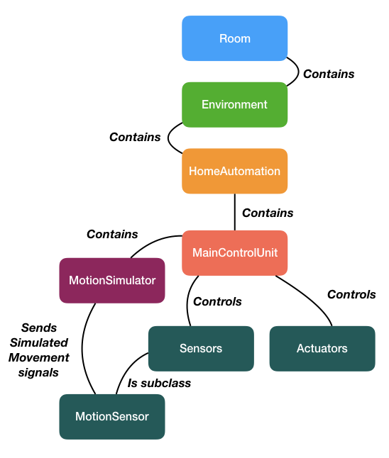

## Models in VDM or Alloy

The solution of HW2 for NTIN043 course. 
Models implemented in `VDM` using `Overture` with `VDM++` dialect.

### How to run?

Solution was implemented in MacOs version of `Overture v 2.6.4`. After cloning the repo, import the `implementation` folder as a project into `Overture`. Use the `Run()` function in `Room` file as the main run configuration to execute the sample pipeline.

### Why VDM++?

This dialect of VDM is based on `VDM-SL`, and has been extended with class and object concepts, which are also present in languages like Smalltalk-80 and Java. This combination facilitates the development of object-oriented formal specifications. This combined with task specification was a main motivation for using it's features while implementing the `home automation` specifications.

### General class interactions diagram

The diagram below represents some of the classes that could be found inside the implementation class. 

#### Room class

Room is used as an entry point class for run configuration. It hold the clock/timer and environment instances. 

#### Environment

Environment is an imitation of conditions within the room, it is used by other classes as a main resource for getting information about current temperature, humidity and motion inside the room.

#### HomeAutomation 

HomeAutomation serves as a high-level configuration setup for defining which sensors and actuators are going to be used by the control unit.

#### MainControlUnit

MainControlUnit hold the various algorithms to control various combinations of sensors defined in HomeAutomation class. In other words, this hold the main logic the whole home automation system.

#### Sensors

##### • Sensor class

Abstract class defining the basic operations that all sensors within the system need to implement.

##### • HumidSensor 

HumidSensor is responsible for reading and reporting the current humidity levels in the `Environment` inside the Room.

##### • TemperatureSensor 

TemperatureSensor is responsible for reading and reporting the current temperature levels in the `Environment` inside the Room.

##### • MotionSensor 

MotionSensor is responsible for reading and reporting whether there is any motion inside the `Environment` inside the Room. Implementation contains some arbitrary `nat` values, however in real use-cases the values is usually represented as a ultrasonic ping time delay converted into milliseconds.

#### Actuators

##### • GeneralActuator

GeneralActuator represents an abstract class used by actuators that require constant interaction with environment. For example, constant monitoring and adjustment of temperature or humidity.

##### • StateActuator

StateActuator represents an abstract class used by actuators that only require maintenance of a certain fixed state. 

##### • SmartLightbulb

SmartLightbulb represents a simple lightbulb that is either turned `ON` or `OFF`. The simple setup inside MainControlUnit reads the current execution time (that simulates 24h format) and triggers that actuator if time of the day is reaching the evening. 

##### • Thermostat 

Thermostat is a GeneralActuator subclass that constantly controls the temperature in the environment.

##### • Window 

Window is a GeneralActuator subclass representing the physical Window, but it also has the ability to affect the humidity in the room while it is being either opened or closed.

### Other classes/files

• `Clock` - simulates timer/clock.  
• `GlobalTypes` - declares all types defining sensors, actuators and etc. Used as identifiers in many classes.  
• `specifications.txt` specified the duration of simulation, target temperature, humidity and duration of sub-simulation.  
• `MotionSimulator` due to the fact that the whole project is mainly defining the specification of the `home automation` project, a simulator of motion is used to simply toggle the environment variable responsible for motion within the environment. This affects the `MotionSensor` that is being triggered and it notifies the host that someone entered the room.  
• `IO` is VDM's system library for interacting with input/output. Only used for `print` command inside the project.  

### Tests

Tests folders contain a simple set of `Assert` tests for checking the type and id of all available actuators and sensors. In order to run the tests specify the `Test()` function in `TestSensors` or `TestActuators` classes in run configuration.

