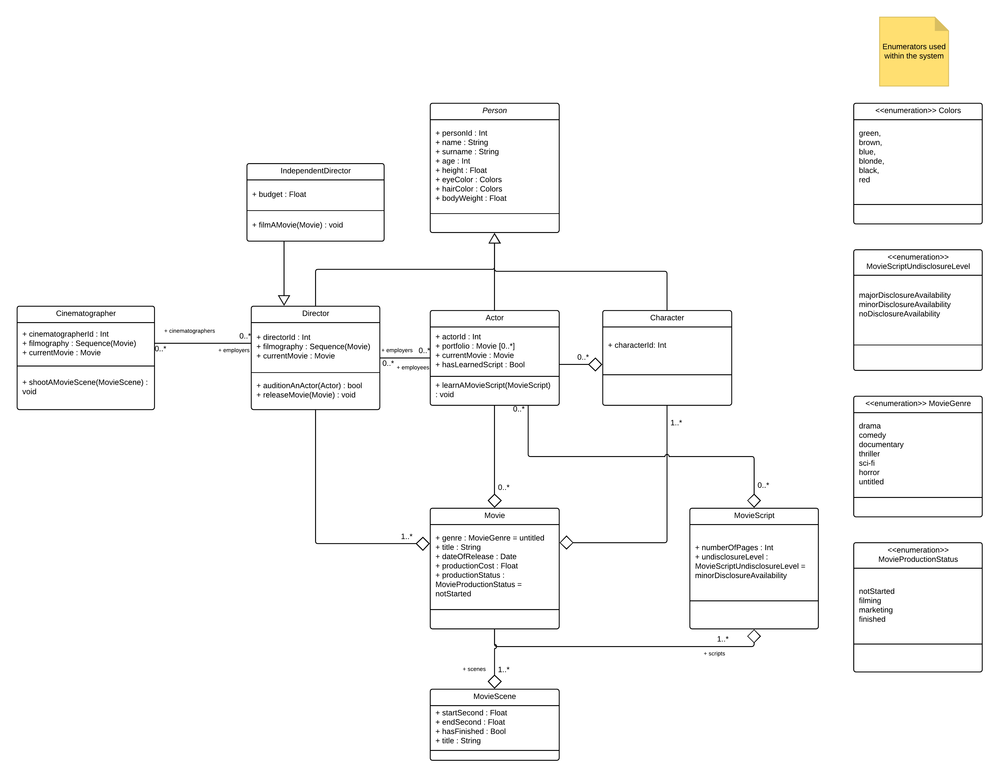

<p align="center"></p>

## Models in UML and OCL

The solution of HW3 for NTIN043 course.
Contains UML diagrams and OCL description for a domain of movies.

### Task 1

1. Create a UML class diagram (conceptual level) for the domain of movies, actors, characters, etc. (at least 5 classes and 10 properties).

#### Solution

<p align="center"></p>

The diagram above represents a simplified domain of typical movie industry.
There are five main classes that inherit from the `Person` class. Those classes are described as follows :

```

    • Director - a main class responsible for finalizing the movies and auditioning the actors.
    • IndependentDirector - a class that inherits from a Director. The main difference is that he is constrained by his own budget.
    • Actor - a main class responsible for playing `Characters` in a movie.
    • Cinematographer - a main class responsible for shooting movie scenes assigned by a `Director`.
    • Character - a class representing a character in a movie based on a `MovieScript`.

```

Aside from `Person` subclasses there are :

```

    • Movie - a main class representing the movie abstraction, can contain multiple scripts, multiple movie scenes and etc.
    • MovieScene - a main class representing a particular scene from a movie. `Cinematographer` sets whether the scene is shot.
    • MovieScript - a main class representing for representing a script for a particular `Movie`.

```

UML also presents a set of enumerators used within the system. The description of them is self explanatory.

### Task 2

2. Write 5 integrity constraints for your UML class diagram in OCL. You must include at least 1 invariant, 1 pre/postcondition and 1 default value definition.

#### 1. Movie

In this OCL snippet we assume that initially Movie has empty Sets of `MovieScript`s, `MovieScene`s.
The main invariant of the `Movie` is that it has to have scripts assigned.

```
context Movie::scripts : Set(MovieScript)
init: Set{}

context Movie::scenes : Set(MovieScene)
init: Set{}

context Movie
inv: self.scripts.size()>0
```

#### 2. Actor

In this OCL snippet we assume that initially Actor has empty Sequence and Set of Movies, Directors.
The `learnAMovieScript` method assumes that provided MovieScript instance is not empty and `self` has not learned this script yet.

```
context Actor
inv : self.employers.size() <= 3

context Actor::portfolio : Sequence(Movie)
init: Sequence{}

context Actor::employers : Set(Director)
init: Set{}

context Actor::learnAMovieScript(MovieScript) : void
pre : not (self.currentMovie.oclIsUndefined()) and hasLearnedScript = False
post : hasLearnedScript = True
```

#### 3. Director

In this OCL snippet we assume that initially, Director has empty Sequence and Sets of Movies, Actors and Cinematographers in its filmography, a collection of employees, and collection of cinematographers.
The `auditionAnActor` method assumes that provided Actor instance is not empty and it has learned the script for the movie. If true, Director assigns the instance of the movie to be made to the `currentMovie` property of an Actor instance.
The `releaseMovie` method assumes that provided Movie instance is not empty and its `productionStatus` is finished. If true, Director adds this movie to his filmography collection.

```
context Director::filmography : Sequence(Movie)
init: Sequence{}

context Director::employees : Set(Actor)
init: Set{}

context Director::cinematographers : Set(Cinematographer)
init: Set{}

context Director
inv: self.employees.size()<=20

context Director::auditionAnActor(Actor) : void
pre : not (Actor.oclIsUndefined())
post : if (Actor::hasLearnedScript = True)
           then Actor::currentMovie = self.currentMovie
       endif

context Director::releaseMovie(Movie) : void
pre : not (Movie.oclIsUndefined())
post : if (Movie::productionStatus = finished)
           then self.filmography.append(Movie)
        endif
```

#### 4. Cinematographer

In this OCL snippet, we assume that initially Cinematographer has empty Sequence and Set of Movies and Directors in its filmography and list of employers. The `shootAMovieScene` method assumes that provided Movie instance is not empty and it has not been shot yet.

```
context Cinematographer::filmography : Sequence(Movie)
init: Sequence{}

context Cinematographer::employers : Set(Director)
init: Set{}

context Cinematographer
inv: self.employers.size()<=3

context Cinematographer::shootAMovieScene(MovieScene) : void
pre : not (MovieScene.oclIsUndefined())
post : if (MovieScene::hasFinished = False)
           then MovieScene::hasFinished = True
       endif
```

#### 5. IndependentDirector

In this OCL snippet, we assume that initially, IndependentDirector has a non zero budget. The `filmAMovie` method assumes that provided Movie instance is not empty and its production cost is not exceeding the independent director's budget.

```
context IndependentDirector
inv: self.budget>0

context IndependentDirector::filmAMovie(Movie) : MovieScene
pre : not (Movie.oclIsUndefined())
post : if (Movie::productionCost < self.budget)
           then
            self.filmography.append(Movie) and
            self.budget = self.budget - Movie::productionCost
       endif
```
